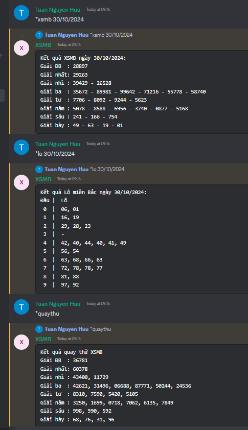

## Create your Mezon application

Visit the [Developers Portal](https://dev-developers.nccsoft.vn/) to create your application.

## Add bot to your clan

Use your install link in a browser to add your bot to your desired clan.

## Installation

```bash
$ yarn
```

Copy `.env.example` to `.env` and replace it with your application token.

## Running the app

```bash
# development
$ yarn start
```

## COMMANDS

```bash
*xsmb [DD/MM/YYYY]
```

Xem kết quả xổ số miền Bắc vào ngày DD/MM/YYYY

```bash
*lo [DD/MM/YYYY]
```

Xem kết quả lô vào ngày DD/MM/YYYY

```bash
*thongke [number]
```

Xem thông kê cho số đó trong tháng này

```bash
*quaythu
```

Quay thử kết quả xổ số miền Bắc

## Help
